# miniproject
My Multithread-HTTP-Server using java.
Here I create a Java Server using Java ServerSocket class and connect it with web browser. 

 

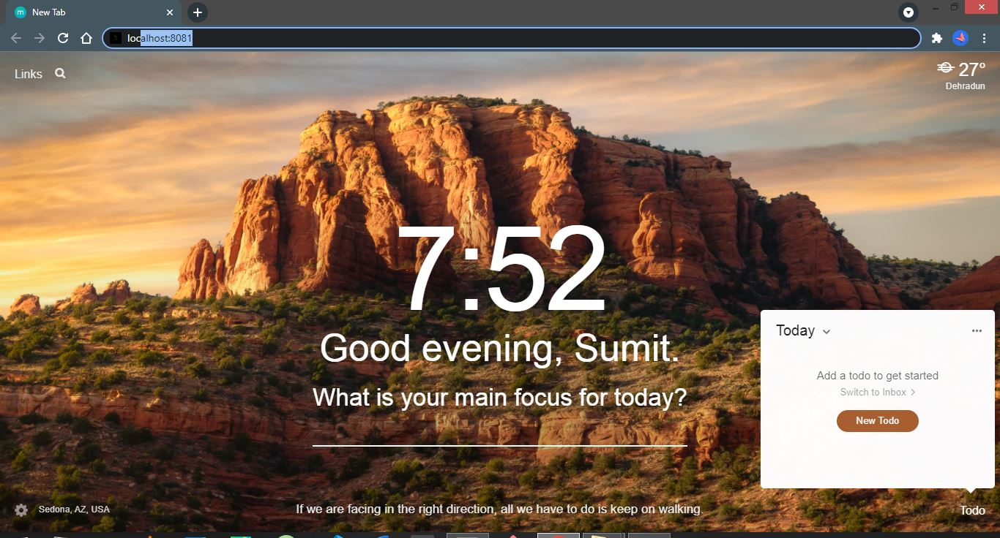
 

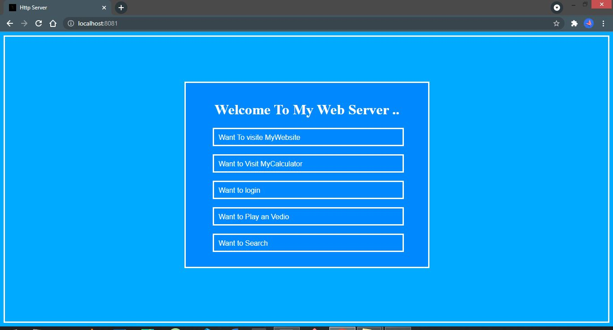
 

 

 

 

 

 

 

 

 

 

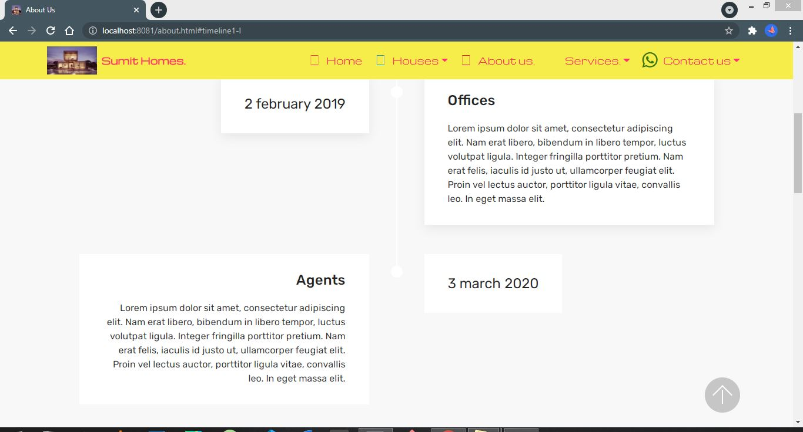
 

 

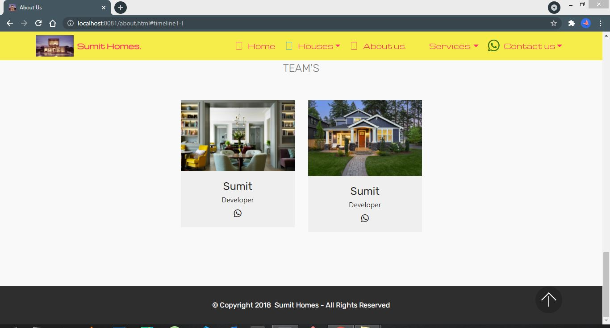
 

 

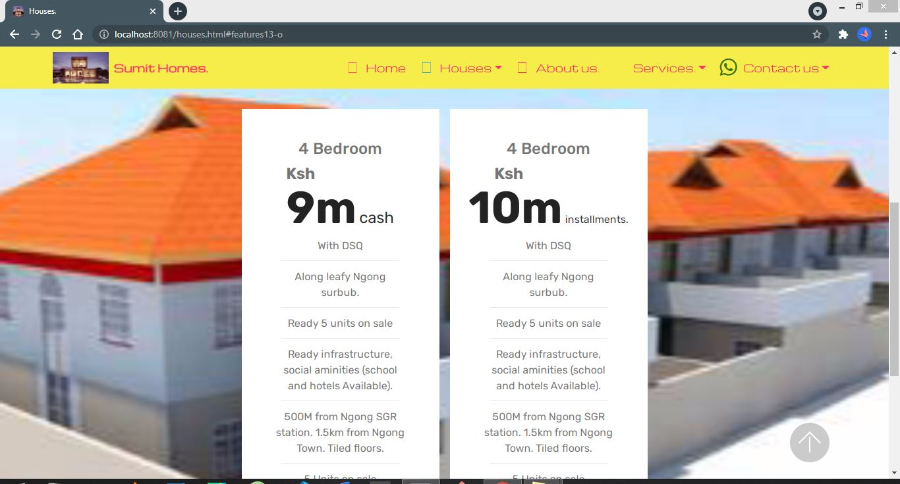
 

 

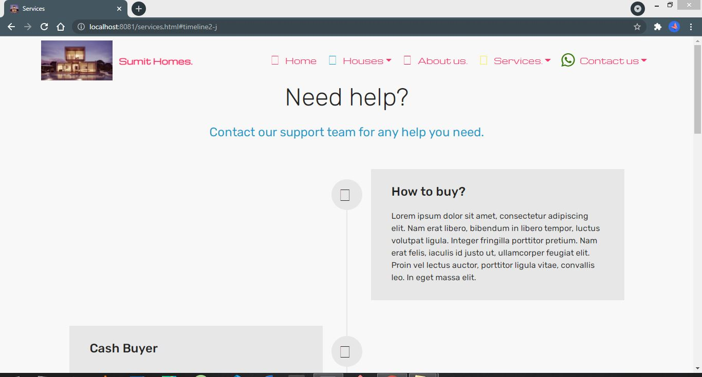
 

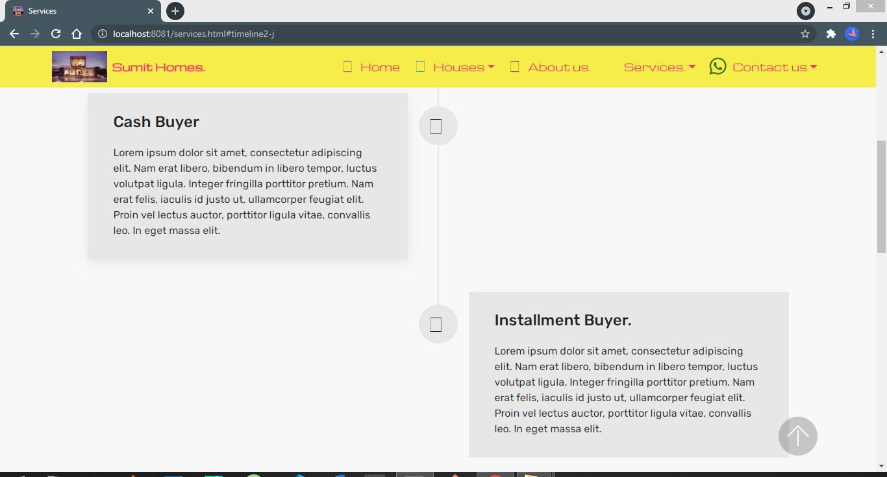
 

 

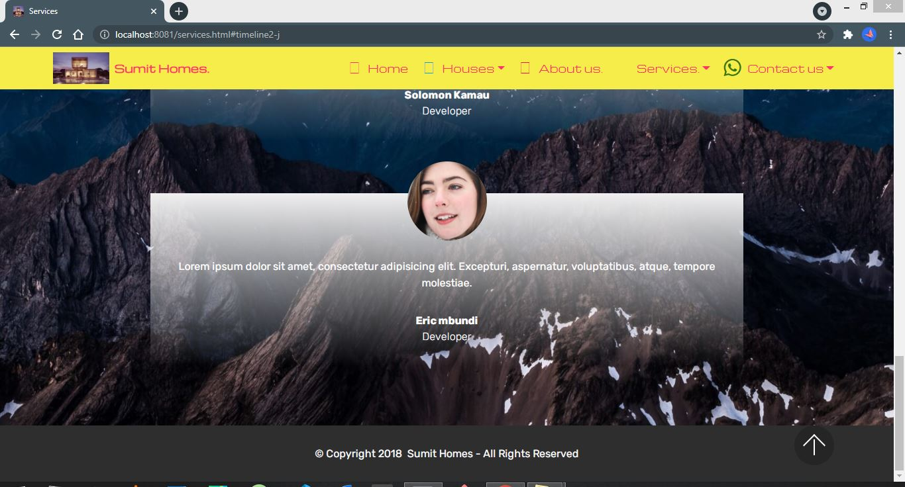
 

 

 

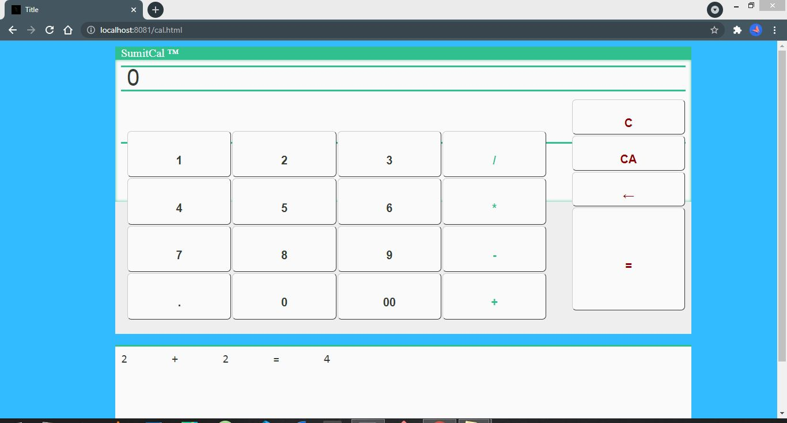
 

 

 

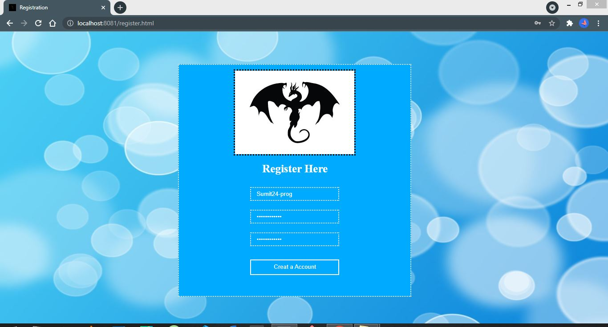
 

 

 

 

 

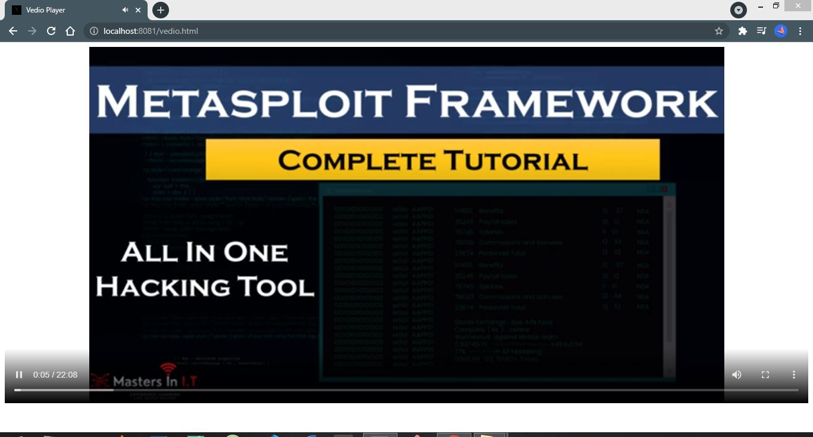
 

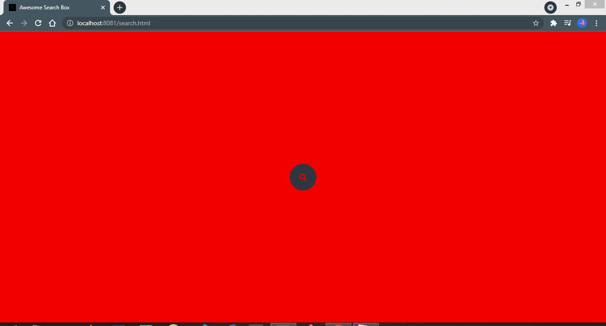
 

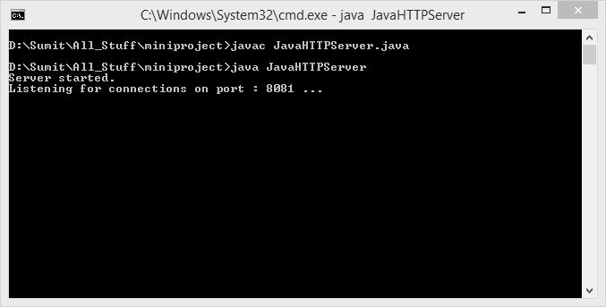
 

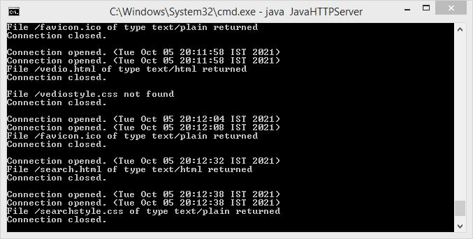
 

