# Miniproject
My Multithread-HTTP-Server using java.
Here I create a Java Server using Java ServerSocket class and connect it with web browser. 

Now ,Compile my Code Using Javac Command and use Java Command to run the server .
After compile
Run it :
And You will get Simmilar Output:

 

Now go to Your Web Browser And Type https://localhost:8081 because our web server is running on 8081 port.
So connect to it using browser.

 

After Typing Press Enter You will see Similar output.

 

Here you can see that Our Web Server can Host a website, a calculator, a Vedio player and a Login Authentication using get method.
And the last option is under progress.
Now Lets view the Website first.

 

Now here you Can see my website which is hosting on localhost in port no. 8081.
Here is Index.html page

 
Let see full Website.
 

 

 

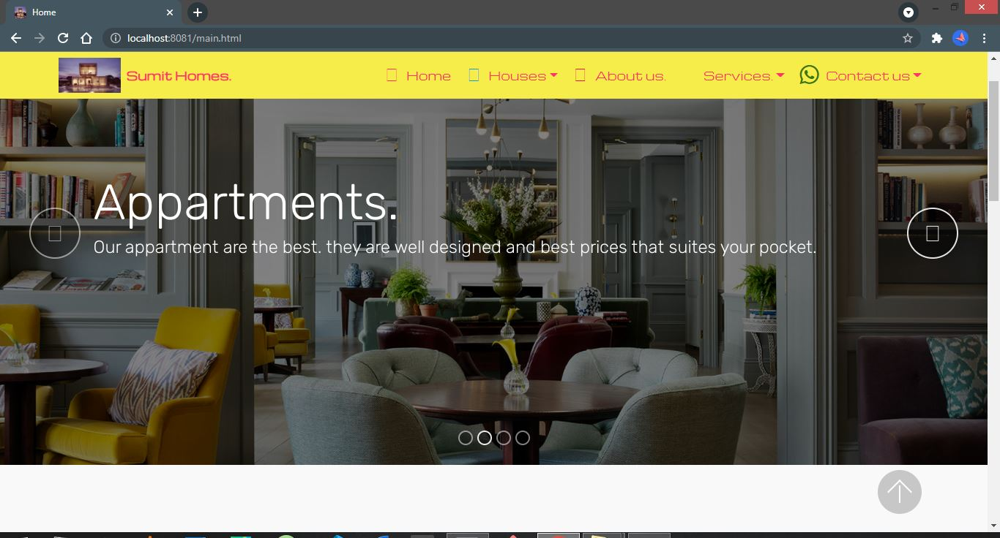

 

 

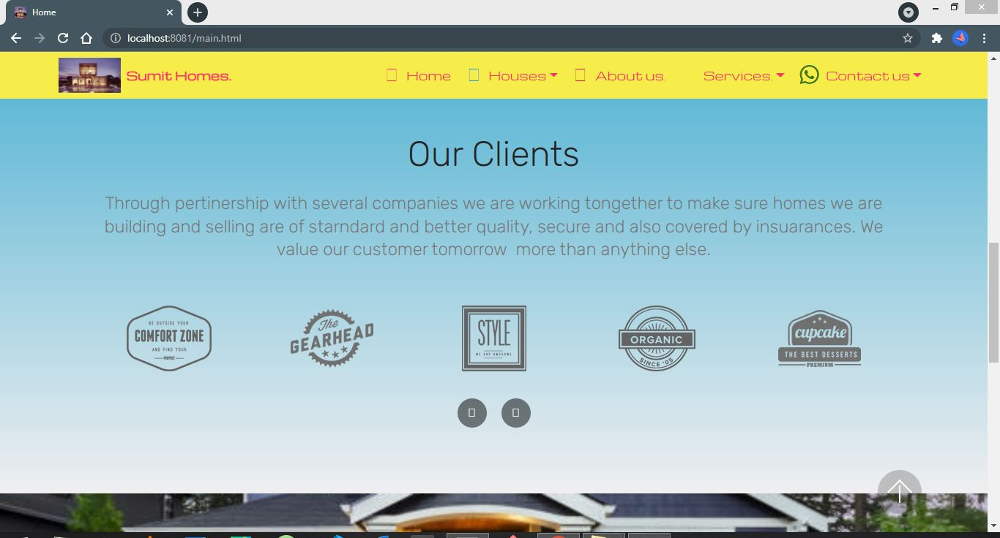

 

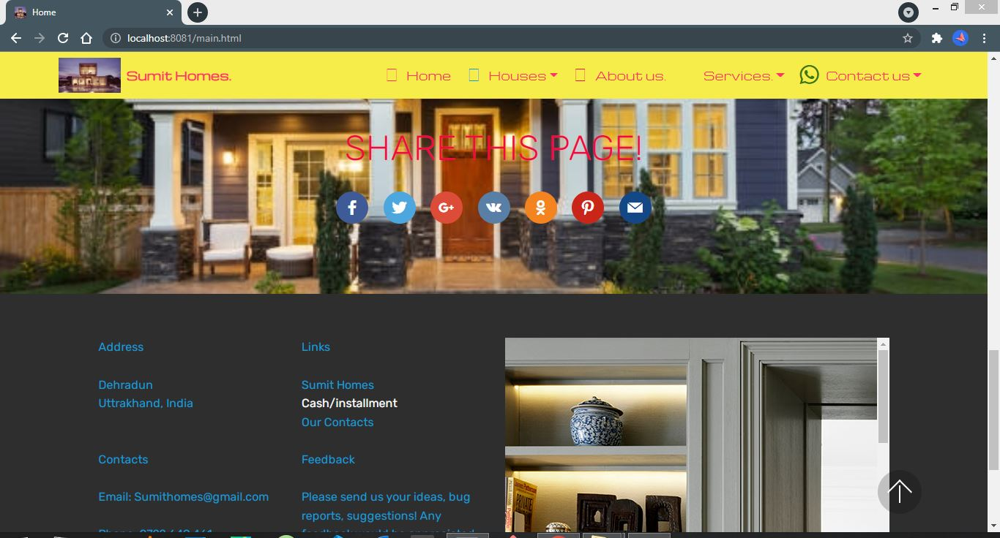

 

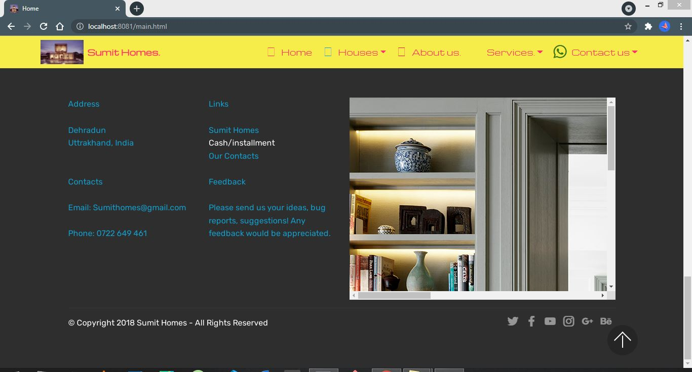

 

 

 

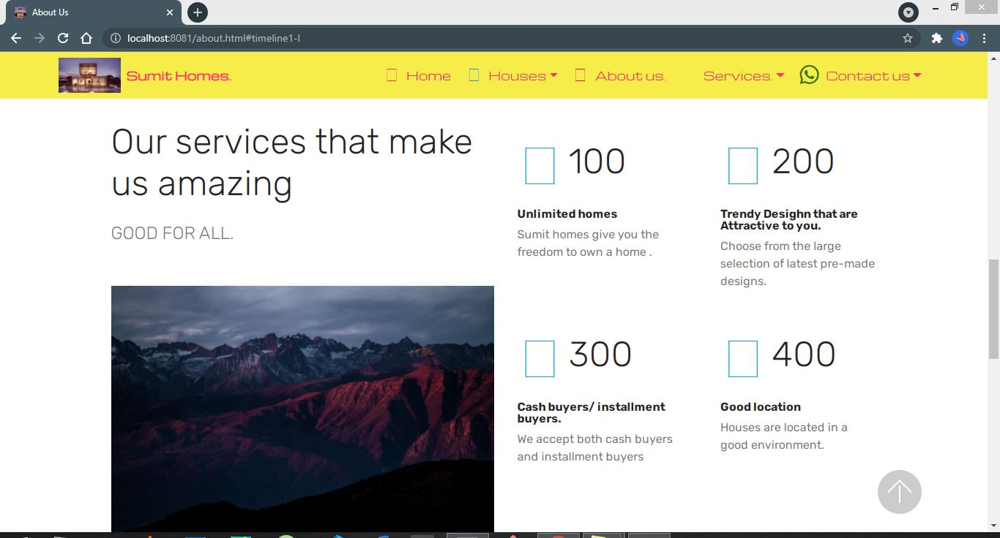

 

 

 

 

 

 

 

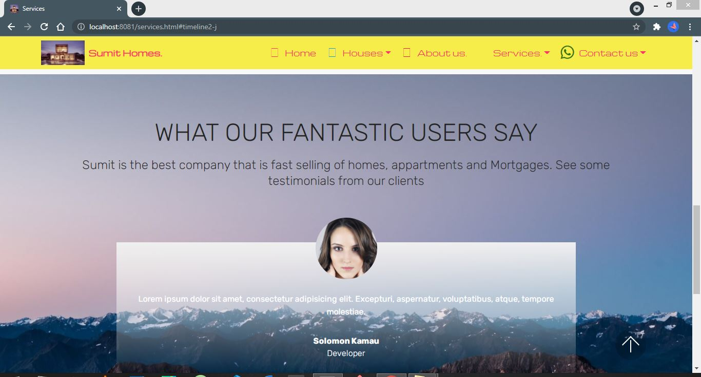

 

 

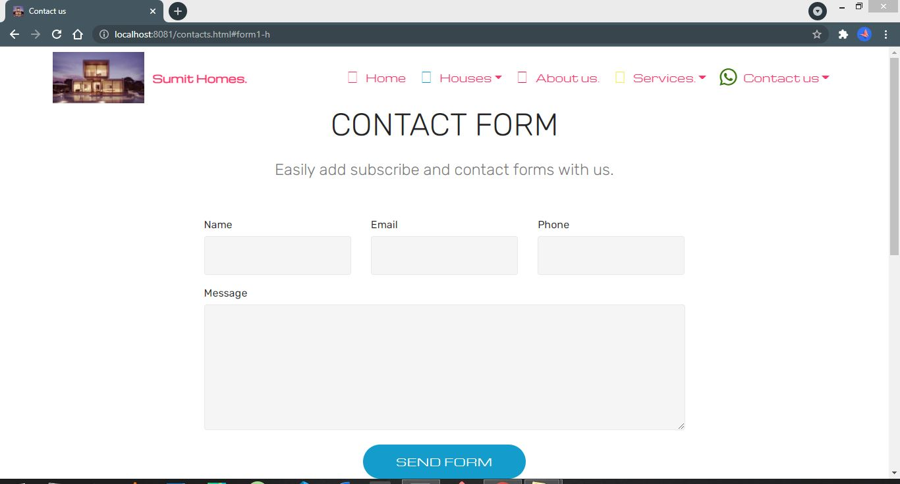

 

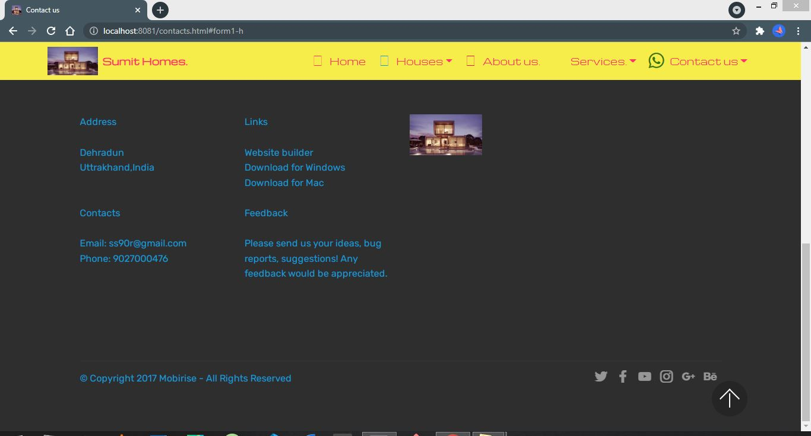

 

Now, let's see calculator.

 

Now, Here is Login Page, First register user using Sumit24-prog name.

 

Here is Register Page.

 

 

Now User is Created SuccesFully.

 

Let's Login.

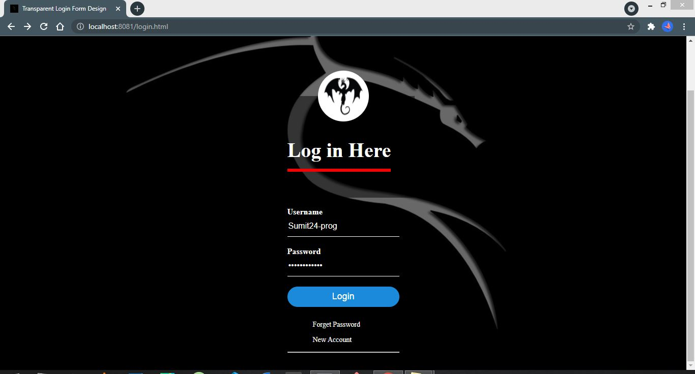

 

SuccesFully Logined.

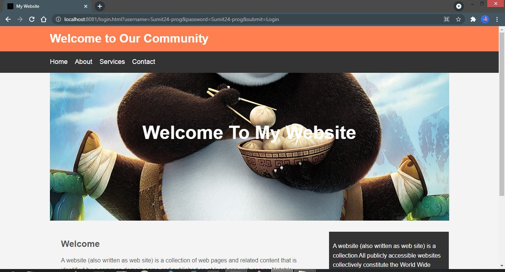

 

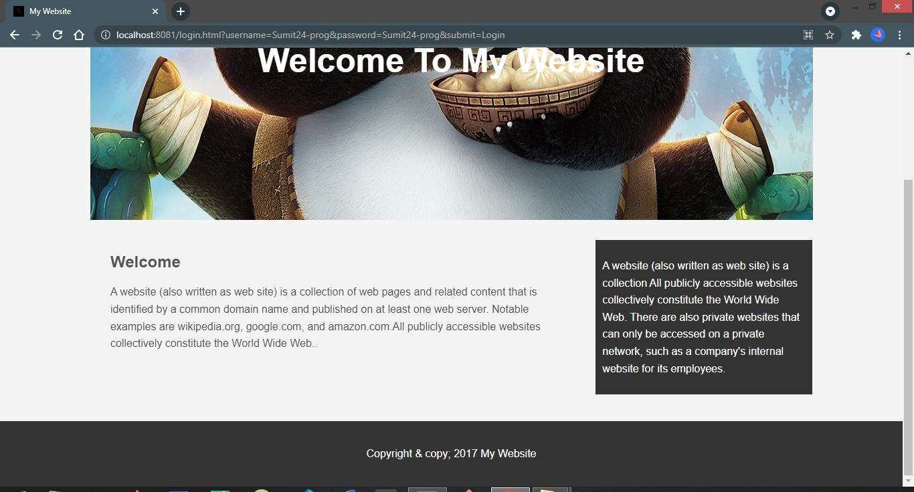

 

Let's See Vedio Player.

 

Here is the last feature that is search but it is under progress.

 

Here is The Output when our web server start.

 

This is the output of Web Server That is running on background.

 

